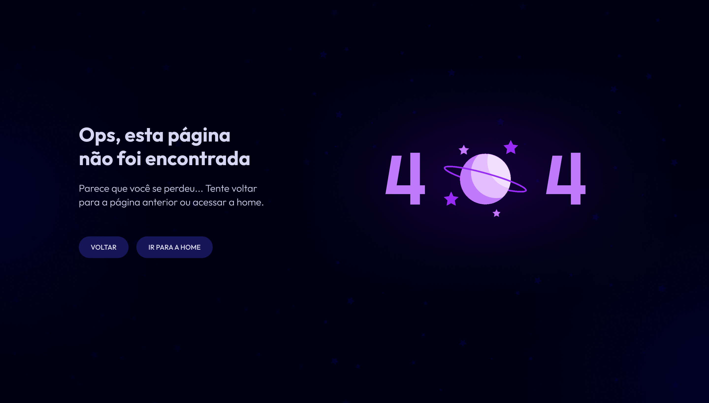

<h1 align="center"> Desafio 27 </h1>

O desafio da semana 27 da Rocketseat é sobre criar uma página web de Page Not Found 404.  

  <a href="#-tecnologias">Tecnologias</a>&nbsp;&nbsp;&nbsp;|&nbsp;&nbsp;&nbsp;
  <a href="#-projeto">Projeto</a>&nbsp;&nbsp;&nbsp;|&nbsp;&nbsp;&nbsp;
  <a href="#-layout">Layout</a>&nbsp;&nbsp;&nbsp;|&nbsp;&nbsp;&nbsp;
  <a href="#-aprendizado">Aprendizado</a>&nbsp;&nbsp;&nbsp;|&nbsp;&nbsp;&nbsp;
  <a href="#-licença">Licença</a>

  

 

  

---
## 🚀 Tecnologias

Esse projeto foi desenvolvido com as seguintes tecnologias:

- HTML e CSS
- Git e Github
- Figma

---

## 💻 Projeto

Desafio é sobre desenvolver uma página web contendo o erro 404 (Error Page not found 404).

[Acesse o projeto finalizado, online](https://Gustavo-Zamai.github.io/desafio-27-Page-Not-Found)

---

## 🔖 Layout

Você pode visualizar o layout do projeto através [Desse Link](https://www.figma.com/file/caHWccgPKQDpSPchr91QY6/P%C3%A1gina-404-%E2%80%A2-Desafio-27-(Community)?node-id=0%3A1&mode=dev). É necessário ter conta no [Figma](https://figma.com) para acessá-lo.

---

## 📑 Aprendizado

Utilizei esse desafio para praticar conceitos do HTML e principalmente CSS que venho estudando, como bordas, displays e alinhamentos, por exemplo. 

---

## 📝 Licença

Esse projeto está sob a licença MIT.

---

Feito com ♥ por Gustavo Zamai
